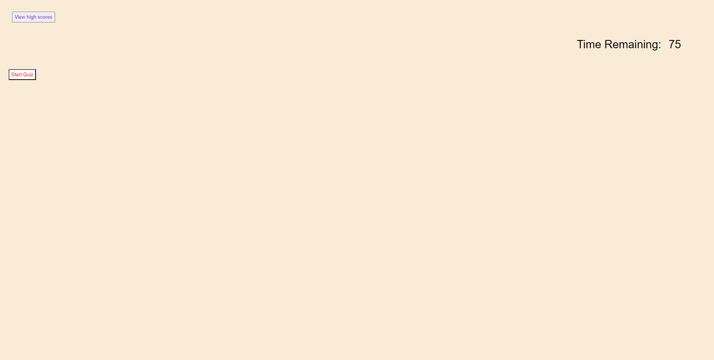

# mod4chal

## Description

I made this project to incorporate lessons learned using form/input elements, local storage, and practice more query selectors. This project creates a fun, timed quiz to test a users basic knowledge of web development. I learned how to create form/input elements with proper type values, and I learned how to create a timer element.

## Installation

Open the index.html file

## Usage

1. First complete the quiz.

2. When the quiz is complete, it'll ask you for your initials, then click submit.

3. If you wish to see your initials and high score, click on view score (doesn't actually work)

## License

MIT License

Copyright (c) [2023] [Edward Chang]

Permission is hereby granted, free of charge, to any person obtaining a copy
of this software and associated documentation files (the "Software"), to deal
in the Software without restriction, including without limitation the rights
to use, copy, modify, merge, publish, distribute, sublicense, and/or sell
copies of the Software, and to permit persons to whom the Software is
furnished to do so, subject to the following conditions:

The above copyright notice and this permission notice shall be included in all
copies or substantial portions of the Software.

THE SOFTWARE IS PROVIDED "AS IS", WITHOUT WARRANTY OF ANY KIND, EXPRESS OR
IMPLIED, INCLUDING BUT NOT LIMITED TO THE WARRANTIES OF MERCHANTABILITY,
FITNESS FOR A PARTICULAR PURPOSE AND NONINFRINGEMENT. IN NO EVENT SHALL THE
AUTHORS OR COPYRIGHT HOLDERS BE LIABLE FOR ANY CLAIM, DAMAGES OR OTHER
LIABILITY, WHETHER IN AN ACTION OF CONTRACT, TORT OR OTHERWISE, ARISING FROM,
OUT OF OR IN CONNECTION WITH THE SOFTWARE OR THE USE OR OTHER DEALINGS IN THE
SOFTWARE.
